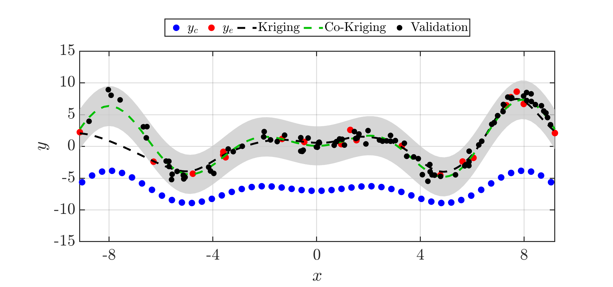
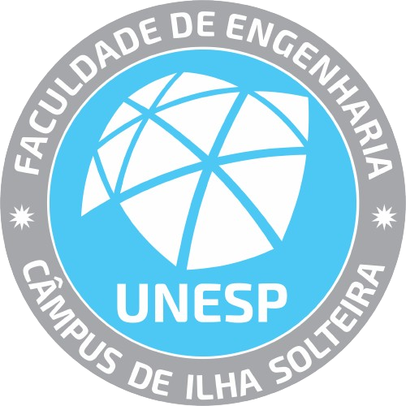
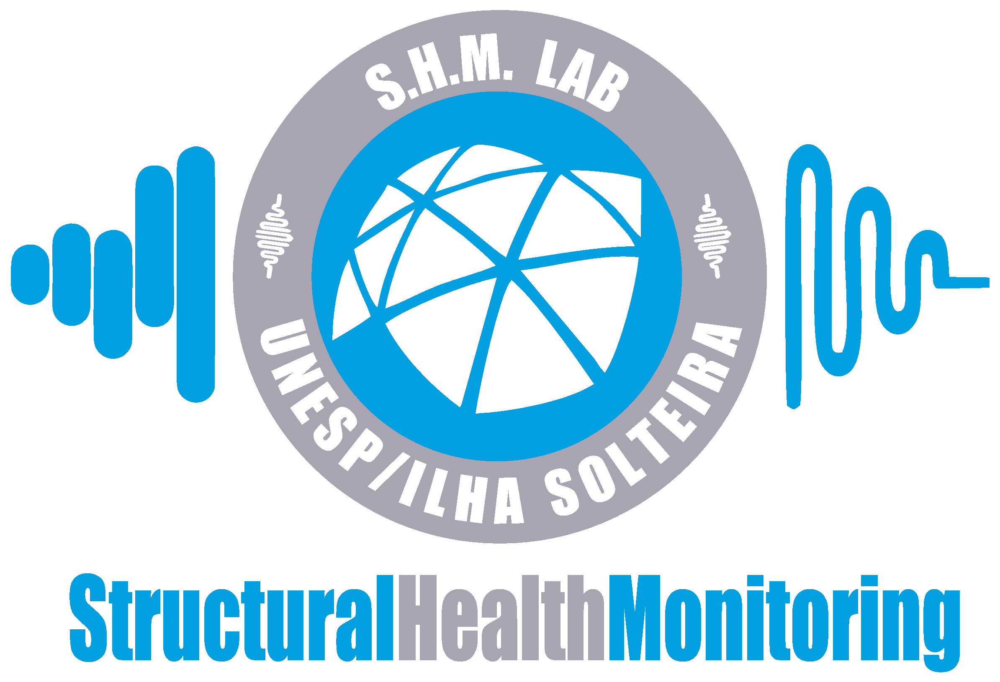
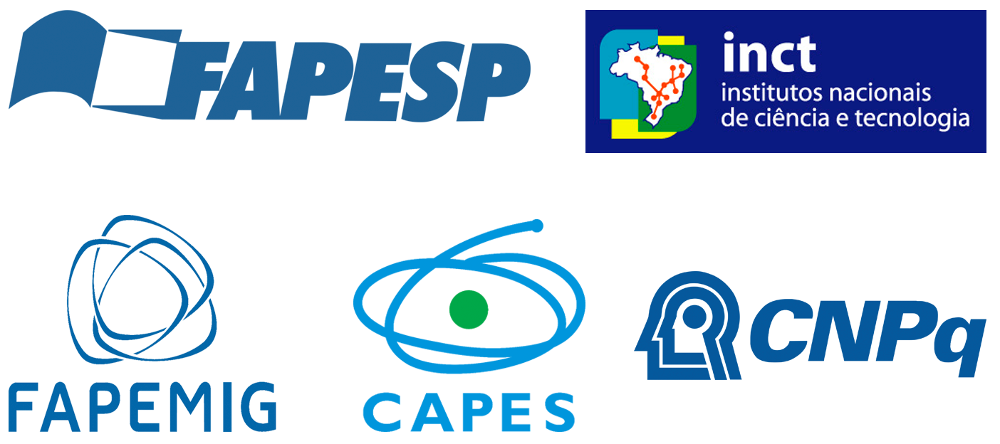

# Co-Kriging Regression Implementation

This repository contains an implementation of the **Co-Kriging regression method**, which objective is to showcase how multi-fidelity modeling can improve prediction accuracy compared to standard Kriging.



---

### Overview
> [!NOTE]
> The framework combines high-fidelity (expensive) and low-fidelity (cheap) data within a multi-fidelity Gaussian process formulation. Initially, a fixed random seed is defined to ensure reproducibility. Two datasets are generated: the expensive dataset represents evaluations from a complex target function, while the cheap dataset corresponds to a simplified and less accurate approximation of the same function. For baseline comparison, a classical Kriging metamodel is constructed using the UQLab interface, where the expensive samples are used to train a Gaussian process over a uniformly defined input domain. A separate validation set is generated for performance assessment. The co-Kriging model is modeled as a scaled version of the cheap response plus a discrepancy Gaussian process. Hyperparameters are estimated through likelihood maximization using dedicated likelihood functions for both the cheap and difference processes. Finally, the script produces comparative plots showing expensive and cheap observations, Kriging predictions, co-Kriging predictions, and corresponding confidence intervals. These results illustrate how multi-fidelity modeling can enhance prediction accuracy when correlated low-fidelity information is available.

ℹ️ **Observation**  
To run this code, it is necessary to have the <a href="https://www.uqlab.com/" target="_blank">UQLab</a> framework installed on your computer.  

### Authors
- Henrique Cordeiro Novais (FEIS/UNESP)
- Samuel da Silva (FEIS/UNESP)

- ### Citing
> [!IMPORTANT]
> If you use this code in your research, please cite the following publications:
> - H. C. Novais and S. da Silva, *[Co-Kriging strategy for structural health monitoring of bridges]*, **Structural Health Monitoring**, 2024. [DOI: 10.1177/14759217241265375](https://journals.sagepub.com/doi/10.1177/14759217241265375)
> - H. C. Novais and S. da Silva, *[Delamination detection and quantification in composites using co-Kriging with Lamb wave data]*, **Mechanical Systems and Signal Processing**, 2025. [DOI: 10.1016/j.ymssp.2025.110040](https://www.sciencedirect.com/science/article/pii/S0888327025010040)


```
@article{NOVAIS2025,
title = {Delamination detection and quantification in composites using co-Kriging with Lamb wave data},
journal = {Mechanical Systems and Signal Processing},
volume = {239},
pages = {113303},
year = {2025},
issn = {0888-3270},
doi = {https://doi.org/10.1016/j.ymssp.2025.113303},
url = {https://www.sciencedirect.com/science/article/pii/S0888327025010040},
author = {Henrique Cordeiro Novais and Samuel da Silva and Christophe Hoareau and Jean-François Deü},
}

@article{NOVAIS2024,
author = {Henrique Cordeiro Novais and Samuel da Silva and Eloi Figueiredo},
title ={Co-Kriging strategy for structural health monitoring of bridges},
journal = {Structural Health Monitoring},
volume = {24},
number = {5},
pages = {2927-2940},
year = {2025},
doi = {10.1177/14759217241265375},
URL = {https://doi.org/10.1177/14759217241265375},   
}
```

### License

This repository is distributed under the MIT license, allowing unrestricted academic and commercial use with proper attribution. See the LICENSE file for details. All new contributions must be made under the MIT license.

 

### Institutional support

This research was conducted within the Department of Mechanical Engineering, School of Engineering of Ilha Solteira (FEIS/UNESP).

 &nbsp; &nbsp; 

### Funding

The development of this work was supported by research agencies through the following grants:

- São Paulo Research Foundation (FAPESP), grant number 2022/12575-7
- National Council for Scientific and Technological Development (CNPq/Brazil)
- National Institute of Science and Technology, Smart Structures in Engineering (INCT-EIE)
   - Funded by the Brazilian agencies:
      -  CNPq, grant number 406148/2022-8
      -  Coordination for the Improvement of Higher Education Personnel (CAPES)
      -  Minas Gerais State Research Support Foundation (FAPEMIG)



### Contact

For questions, collaborations, or further information, please contact:

- **Henrique Cordeiro Novais** — [henrique.cnovais@unesp.br](mailto:henrique.cnovais@unesp.br)  
- **Prof. Samuel da Silva** — [samuel.silva13@unesp.br](mailto:samuel.silva13@unesp.br)


